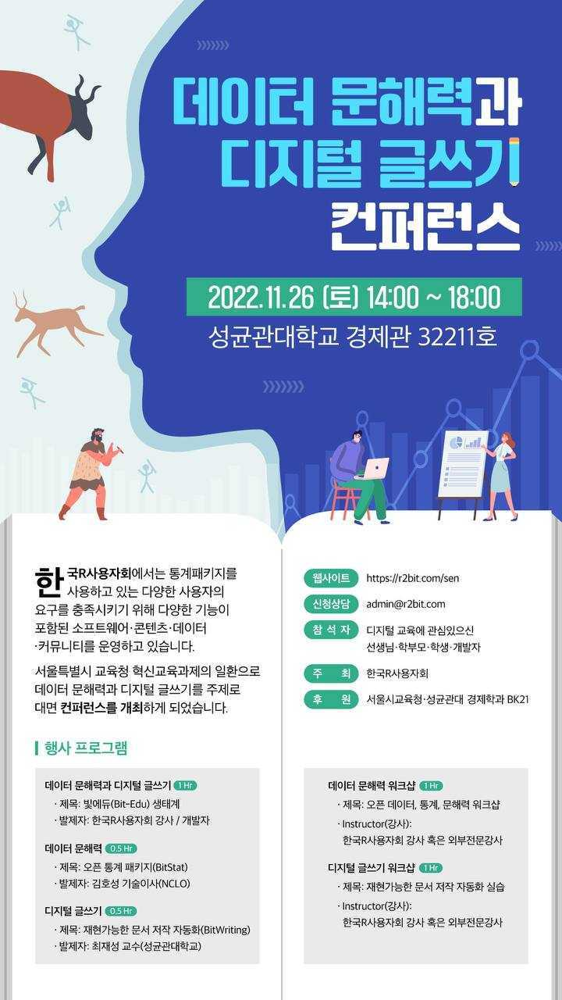

## Quarto 워크샵

한국 R 사용자회에서는 통계패키지를 사용하고 있는 다양한 사용자의 요구를 충족시키기 위해 다양한 기능이 포함된 소프트웨어, 콘텐츠, 데이터, 커뮤니티를 운영하고 있습니다.
서울특별시교육청 혁신교육과제의 일환으로 데이터 문해력과 디지털 글쓰기를 주제로 대면 컨퍼런스를 아래와 같이 개최하게 되었습니다.

- 일시: 2022년 11월 26일 (토) 14:00 ~ 18:00
- 장소: 성균관대학교 경제관 32211 호
- 참석자: 디지털 교육 관심있으신 선생님, 학부모, 학생, 개발자
- 웹사이트: https://r2bit.com/sen/
